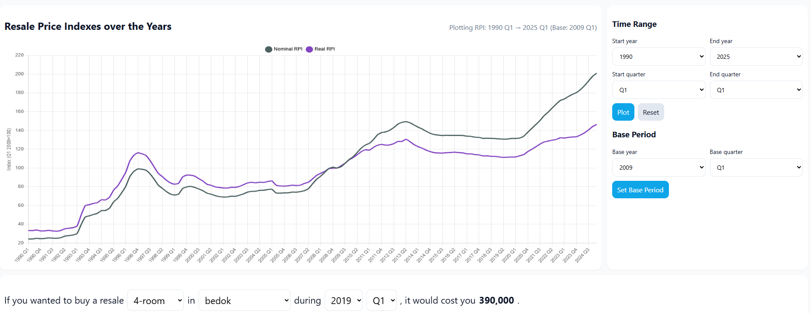

# Interative Chart Detailing Resale Price Index Of HDB Flats Over The Years

## Features
* Option to change base quarter for RPI and CPI
* Automatically adjusts Nominal RPI and Real RPI based on selected base period
* Choose your range of dates
* Find average resale price of houses by Housing Type, Location, Base Year and Base Quarter
* Hover to display values of Nominal and Real RPI for that data point

## Sources
* Consumer Price Index (CPI), 2024 As Base Year, Monthly
https://data.gov.sg/datasets/d_bdaff844e3ef89d39fceb962ff8f0791/view
* Housing And Development Board (HDB) Resale Price Index (1Q2009 = 100), Quarterly
https://data.gov.sg/datasets/d_f0c768860912d66940efdac9435dc046/view
